<p align="center">
  
</p>

<p align="center">
  <a href="https://github.com/Alchemy86/agentic-preview/actions/workflows/ci.yml"></a>
  <a href="https://github.com/Alchemy86/agentic-preview/releases/latest"></a>
  <a href="https://artifacthub.io/packages/search?repo=agentic-preview"></a>
</p>

---

`agentic-preview` raises header-routed [Telepresence](https://www.telepresence.io/)
preview environments in Kubernetes, from an HTTP call: POST it a work id, a service and an
image, and it builds the preview and diverts every request carrying that header value to
it. It runs as an ordinary Deployment inside the cluster — no Telepresence CLI, no
connector daemon, no TUN device, no root, no laptop, and no human in the loop.

The preview is a **copy of the live workload** with your image in it. Same environment,
same config and secret references, same pull credentials, same probes, same service
account — because they were copied from the running Deployment rather than guessed at.

---

## The problem it solves

CI builds a pull request. Now someone has to look at it, in a system that means anything —
which means the change has to sit *inside* a real cluster, talking to the real services
around it.

The usual answers are all bad in the same way. Give the branch its own namespace and you
have cloned a whole estate to look at one service. Give it its own ingress hostname and
everything downstream still points at live. Wait for a shared staging slot and only one
change can be in flight at a time.

Header routing is the answer that scales: leave everything live, and divert *only* requests
carrying a chosen header to the changed service. Telepresence already does exactly this —
but through a CLI that runs on a developer's laptop, holding a session over a TUN device
and needing root to do it. A pipeline cannot drive that. So it stays a manual, interactive,
one-person-at-a-time tool.

`agentic-preview` is the same mechanism with the laptop taken out. One `POST` from a
pipeline step builds the preview and makes the header live; one `DELETE` when you are
finished with it and both are gone.

**And it holds a change together across repositories.** A work id — whatever id your issue
tracker gives one piece of work — is the primary key *and* the header value. The API, the
worker and a shared library land as three separate PRs, each joining the same work id as it
builds, and one header reaches all three. That is the thing a PR number cannot do.

## How it works

A call raises a preview. A header reaches it. Everything else reaches live.

1. **`POST /previews`** with a work id, a service, a namespace and an image. agentic-preview
   copies the live Deployment, swaps in your image, and puts a Service in front of the copy.
2. It tells the traffic-manager to divert requests carrying one header value — your work id
   — to that Service, and holds the tunnel that carries them.
3. A request with the header reaches your preview. A request without it reaches the live
   pod, unchanged and unaware.
4. **`DELETE /previews/{workId}`** removes the intercepts and everything it built.

The forwarding happens inside agentic-preview's own process, from inside the cluster, with a
plain `net.Dial` to a ClusterIP. That is why there is no tunnelling, no routing table and no
privilege involved anywhere — and it is the one design fact the whole service is built on.
It is worth reading properly: **[Design and measured behaviour](docs/DESIGN.md)**.

A worked example, from pull request to teardown, is in
[docs/WORKED-EXAMPLE.md](docs/WORKED-EXAMPLE.md).

## Feature map

```mermaid
flowchart TB
    ROOT(["agentic-preview"])

    ROOT --> B
    ROOT --> R
    ROOT --> D
    ROOT --> L
    ROOT --> S
    ROOT --> O

    subgraph B["Building"]
        direction TB
        B1["Preview is a COPY of<br/>the live Deployment"]
        B2["Env, config, secrets, pull<br/>creds, probes, SA carried"]
        B3["Image taken verbatim:<br/>no tag conventions"]
        B4["Refuses to build a pod<br/>live traffic could claim"]
    end

    subgraph R["Routing"]
        direction TB
        R1["One header reaches<br/>a whole change"]
        R2["Many services per id,<br/>joined as each PR builds"]
        R3["Header name is service<br/>config, not per-request"]
        R4["Two work ids, one<br/>workload, at once"]
        R5["Or a declared window:<br/>whole workload, no header"]
    end

    subgraph D["Durability"]
        direction TB
        D1["Survives a target-pod<br/>rollout"]
        D2["Survives a manager<br/>restart"]
        D3["Re-raises previews onto<br/>a rebuilt session"]
        D4["One tunnel per agent pod,<br/>not per preview"]
    end

    subgraph L["Lifecycle"]
        direction TB
        L1["POST is idempotent:<br/>retries roll it forward"]
        L2["Teardown is explicit;<br/>a merge is not a trigger"]
        L3["Lifetime safety net,<br/>switchable off"]
        L4["Drop one service, or<br/>a whole work id"]
    end

    subgraph S["Safety"]
        direction TB
        S1["Allow-list bounds intercept,<br/>build AND forward target"]
        S2["Bearer SA token,<br/>re-read every call"]
        S3["Session credential for<br/>a verified WatchDial"]
        S4["Deletes and overwrites only<br/>what carries its own label"]
    end

    subgraph O["Operability"]
        direction TB
        O1["/readyz reports a session<br/>per namespace, and every tunnel"]
        O2["Refusals name the field<br/>to fix"]
        O3["Reports image, age<br/>and expiry per preview"]
        O4["Namespaced RBAC only,<br/>never cluster-wide"]
    end

    classDef root fill:#0d1117,stroke:#32d46d,stroke-width:3px,color:#f0f3f6
    classDef leaf fill:#161b22,stroke:#30363d,stroke-width:1px,color:#f0f3f6
    class ROOT root
    class B1,B2,B3,B4,R1,R2,R3,R4,D1,D2,D3,D4,L1,L2,L3,L4,S1,S2,S3,S4,O1,O2,O3,O4 leaf
    style B fill:#0d1117,stroke:#32d46d,stroke-width:2px,color:#32d46d
    style R fill:#0d1117,stroke:#32d46d,stroke-width:2px,color:#32d46d
    style D fill:#0d1117,stroke:#32d46d,stroke-width:2px,color:#32d46d
    style L fill:#0d1117,stroke:#32d46d,stroke-width:2px,color:#32d46d
    style S fill:#0d1117,stroke:#32d46d,stroke-width:2px,color:#32d46d
    style O fill:#0d1117,stroke:#32d46d,stroke-width:2px,color:#32d46d
```



## Installing it

**Prerequisite:** a Telepresence traffic-manager already running in the cluster, v2.30.0 or
later — the reconciler that makes a preview survive a target-pod rollout landed in v2.30.0.
agentic-preview does not install Telepresence.

Two ways in, installing the same objects. Helm is the shorter one and keeps the namespace
list in step for you; the raw manifests in `deploy/` are still there for anyone who would
rather not have Helm in the path.

```bash
helm repo add agentic-preview https://alchemy86.github.io/agentic-preview
helm repo update

helm install agentic-preview agentic-preview/agentic-preview \
  --namespace agentic-preview --create-namespace \
  --set 'allowedNamespaces={shop,warehouse}'
```

Or, after replacing the four placeholders catalogued in
[`deploy/kustomization.yaml`](deploy/kustomization.yaml):

```bash
kubectl apply -k deploy/
```

Either way it is ready only once a manager session exists — one per allowed namespace,
and `disconnectedNamespaces` names any that are short — so a green `/readyz` means it
can actually raise something.

### Get `allowedNamespaces` right

This is the one install decision you must not get wrong. It names the namespaces
agentic-preview may intercept in, build previews in, and forward to — and `shop` and
`warehouse` above are **fictional examples**, not a default worth keeping.

**It has no default and the chart refuses to render without it**, with a message explaining
why rather than a CrashLoopBackOff you have to read logs to explain. An empty list read as
"everything" is the wrong failure.

It bounds three ends of a preview, and those three are *not* otherwise bounded by the same
thing. Intercepting and building are authorized by Kubernetes
— namespaced Roles, never a ClusterRole. **Forwarding is authorized by nothing:** it is a
plain `net.Dial` from this pod to a ClusterIP, and no Kubernetes permission is consulted for
it. So this list is the only thing standing between a caller and forwarding intercepted
production traffic to any Service anywhere in the cluster.

The chart generates all three of the things that have to agree — the attach Roles, the build
Roles, and `ALLOWED_NAMESPACES` on the container — from that one list, which is the only
place they cannot drift. With the raw manifests, you keep both sets of Roles in
`deploy/rbac.yaml` and the env var in `deploy/deployment.yaml` naming the same set yourself.

### The `kubectl` plugin

One file, onto your PATH. kubectl finds it by name — the underscore is what becomes the
space in `kubectl agentic-preview`:

```bash
curl -fsSLo ~/.local/bin/kubectl-agentic_preview https://raw.githubusercontent.com/Alchemy86/agentic-preview/main/hack/kubectl-agentic_preview
chmod +x ~/.local/bin/kubectl-agentic_preview
```

It is a shell script over `kubectl` and nothing else — no binary, no Go client, no
credentials of its own. Installed the service somewhere other than a namespace called
`agentic-preview`? `export AGENTIC_PREVIEW_NAMESPACE=<ns>`.
**More:** [docs/PLUGIN.md](docs/PLUGIN.md).

**Full install reference**, including digest pinning, the placeholder table and the
traffic-manager namespace: **[docs/INSTALL.md](docs/INSTALL.md)**. Every environment
variable: **[docs/CONFIGURATION.md](docs/CONFIGURATION.md)**.

## Using it

Raising a preview and dropping it again are one command each:

```bash
kubectl agentic-preview up checkout-api -n shop \
    -i registry.example.com/checkout-api:pr-1234 -w 1234 -p http

curl -H 'x-preview: 1234' https://your-ingress/checkout   # your preview
curl                      https://your-ingress/checkout   # live, unchanged and unaware

kubectl agentic-preview down 1234
```

`list` shows every work id, what it spans, the image each preview runs and when it
expires; `status` reports the manager session and one entry per live tunnel. There is no
port-forward and no URL anywhere in that, because the plugin reaches the service through
the API server's own service proxy. `kubectl agentic-preview --help` is the whole manual.

### The API

The plugin is a wrapper over an HTTP API and holds no privileges of its own. A pipeline
step should call that API directly.

```
POST   /previews                                  build a preview of one service and
                                                  route its header
GET    /previews                                  every work id, what it spans, what
                                                  image each runs, age and expiry
GET    /previews/{workId}                         one work id's service set
DELETE /previews/{workId}/{namespace}/{workload}  remove one service of a work id
DELETE /previews/{workId}                         remove a whole work id
GET    /schedules                                 declared schedules and their state
POST   /schedules/{name}/override                 force one open or closed now, or auto
GET    /healthz                                   liveness
GET    /readyz                                    a session per allowed namespace, and every tunnel
```

One `POST` builds the preview and routes the header:

```bash
curl -XPOST http://agentic-preview.agentic-preview.svc.cluster.local/previews \
  -H 'content-type: application/json' \
  -d '{"workId":"1234","workload":"checkout-api","namespace":"shop",
       "image":"registry.example.com/checkout-api:pr-1234","port":"http"}'
```

| Field | Meaning |
| :--- | :--- |
| `workId` | **required** — any string you pick. The header value, and the key everything is grouped under. Never parsed. |
| `workload` | **required** — the live Deployment to copy and to intercept. |
| `namespace` | **required** — where it lives. Must be in `ALLOWED_NAMESPACES`. |
| `image` | The image to run, **verbatim**. Setting it is what asks for a preview to be built. |
| `replicas` | How many preview pods. Default 1, maximum 10. |
| `container` | Which container's image to swap. Only needed when the pod has several and none is named after the workload. |
| `sourceService` | The live Service whose ports are copied. Defaults to `workload`. |
| `port` | The port identifier on the *live* workload — a service port name or number. Default `80`. |
| `previewService` | Instead of `image`: route to a Service **you** deployed. The two are mutually exclusive. |

POSTing the same work id again **adds** a service to it; the same work id *and* service with
the same image is a no-op, and with a new image rolls the Deployment forward without
touching the intercept — so a pipeline retry is safe and a new commit is one call.

Runnable versions of all five operations are in **[`examples/`](examples/)** — plain `curl`,
because a pipeline step is going to be a `curl` anyway. Every field and response in full:
[docs/DESIGN.md](docs/DESIGN.md#the-api); the plugin: [docs/PLUGIN.md](docs/PLUGIN.md).

## What it deliberately does not do

These are boundaries, not gaps waiting to be filled. Most exist because the alternative
would only ever be right for one company's pipeline.

- **It does not trigger anything.** It receives calls. Nothing watches a repository, a
  registry, a webhook or a queue. *Triggering is the adopter's job.*
- **It knows nothing about how an image came to exist, or what its tag means.** You give it
  a reference and it runs that reference, verbatim. A tool that guessed at tag conventions
  would be wrong everywhere but the one place it was written.
- **It has no notion of a pull request.** A work id is an opaque string, never parsed.
  Nothing tears a preview down because a branch merged.
- **It does not build or push images.** Your CI already does.
- **It does not manage DNS, ingress or certificates.** Traffic arrives through the ingress
  you already have; the header is the only thing that changes.
- **It does not accept a per-request header name.** Two services of one work id behind
  different header names would destroy the one guarantee a work id exists for.
- **It does not scale out.** Exactly one replica, `strategy: Recreate` — two would each
  arrive as their own session and collide raising identical header filters.
- **It does not authenticate its callers.** ClusterIP, no Ingress, no API key. Put it where
  only your pipeline can reach it.
- **It does not touch the cluster outside its allow-list**, and holds no ClusterRole at all.
- **It does not install or manage Telepresence.**

Each of these stated in full, with the reasoning:
**[docs/NON-GOALS.md](docs/NON-GOALS.md)**.

## Honest limits

Worth reading *before* you deploy it, not after. Every number below was measured on a real
cluster.

- **A forced kill leaves headers hanging, and it does not fail open.** On `SIGTERM` every
  header falls through to the live pod in under 0.31s. On `SIGKILL` the intercepts stay in
  manager state with nobody holding their tunnel and requests carrying those headers hang —
  no response after 15s or 90s, while unmarked traffic served normally in 1.5s. Only the
  specific header value is affected, and the next `POST` for that service clears it.
- **There is an 18s window during a target-pod rollout** while the tunnel is rebuilt to the
  new node-agent. Preview headers hang in it; unmarked traffic is unaffected.
- **Every replica of an intercepted workload needs its own tunnel**, because every replica
  gets its own node-agent and traffic reaching one with no tunnel is *held* rather than
  failed over. agentic-preview holds one per agent pod and reports both the tunnels it has
  and the agent count the manager gave, so a shortfall is visible; the residual gap is a
  replica that arrives before its node-agent Job does, and that one fails open.
- **A preview can be built and still not run.** A create waits 120s for the pods and fails
  the `POST` with the reason Kubernetes gives rather than raising an intercept that would
  hang. The objects are left in place so you can look at them.
- **The preview's pod labels are copied from live**, so agentic-preview checks them against
  every Service selector in the namespace and *refuses* rather than risk a preview pod
  joining the live EndpointSlice. A workload whose Service selects on something unexpected
  gets a refusal, not a preview.
- **A restart puts previews out of the timer's reach.** The registry is in memory. Strays are
  always findable by label — `kubectl get deploy,svc -A -l
  app.kubernetes.io/managed-by=agentic-preview` — and a `DELETE` finds them the same way, but
  cleanup after a restart is somebody asking, not a timer.
- **The 24h `PREVIEW_LIFETIME` timer may not be what you want.** If something else cleans
  previews up, turn it off: a timer that removes a preview while somebody is still testing
  against it is worse than a forgotten pod.
- **If you expire preview images, exclude the ones in use.** `GET /previews` reports the
  image each preview runs precisely so a retention policy can skip them.
- **A [schedule](docs/SCHEDULES.md) has two kinds and a `type:` that says which.**
  `type: intercept` diverts a whole workload; `type: dns` redirects one DNS name by writing a
  line into a CoreDNS ConfigMap, for a dependency that is not a workload at all. The second
  needs a ConfigMap named in config and a permission the shipped RBAC deliberately does not
  grant; without it the schedule alarms rather than crash-looping. Either kind can be forced
  open or closed on demand, on the same authenticated surface a preview is raised on.
- **A [scheduled intercept](docs/SCHEDULES.md) cannot share a workload with a preview**, and
  a scheduled intercept that dies takes *all* of that workload's traffic with it rather than
  one header's worth. Both are refusals rather than surprises — both directions of the clash
  are refused loudly, and an open window's intercept is re-checked against the manager every
  30s. That mode is off unless you declare a window.

Each of these in full, with the code-level evidence: **[docs/LIMITS.md](docs/LIMITS.md)**.

## Licence

**Apache License 2.0** — see [`LICENSE`](LICENSE), [`NOTICE`](NOTICE) and
[why](docs/LICENSING.md).

---

**More detail:** [design and measured behaviour](docs/DESIGN.md) ·
[installing](docs/INSTALL.md) · [the kubectl plugin](docs/PLUGIN.md) ·
[configuration](docs/CONFIGURATION.md) ·
[worked example](docs/WORKED-EXAMPLE.md) · [non-goals](docs/NON-GOALS.md) ·
[limits](docs/LIMITS.md) ·
[building and testing](docs/DEVELOPING.md) · [the chart](docs/CHART.md) ·
[the mark](docs/BRAND.md) · [all docs](docs/)
