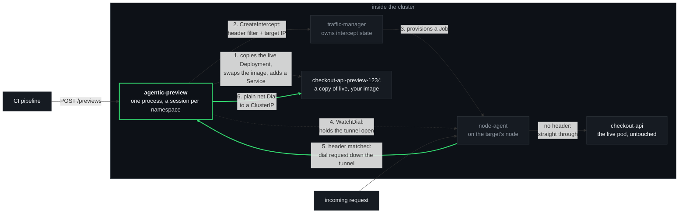

<p align="center">
  
</p>

---

# agentic-preview — design and measured behaviour

`agentic-preview` raises header-routed telepresence previews from an HTTP call. No
telepresence CLI, no connector daemon, no TUN device, no root, no laptop, no human. It
runs as an ordinary Deployment and a pipeline drives it.

It takes a whole preview in one call. Give it a work id, a service, a namespace and an
image reference: it reads the live Deployment, copies it with your image in place of the
live one, puts a `Service` in front of the copy, tells the traffic-manager to divert
requests carrying one header to that Service, and holds the tunnel that carries them.

It does not build the image and it does not decide when to call — your CI already knows
both. Give it a `previewService` instead of an `image` and it skips the building entirely
and does the intercept half only, which is what it did before it could create anything.

> **About the numbers in this document.** Every figure quoted here — the 0.31s fall-through,
> the 18s rollout window, the hang after 15s and 90s, the 24h TTL — was measured on a real
> Kubernetes cluster running telepresence, not estimated and not read off a datasheet. The
> examples are written around a fictional `checkout-api` in a namespace called `shop`
> because the cluster it was measured on is not yours; the behaviour is not fictional.

---

## The one design fact that shapes everything

`InterceptSpec.target_host` reads like an address the traffic-agent connects to. **It is
not. The agent never dials it.**

For each intercepted request the agent opens a tunnel back to the *client session* and
sends the destination down it as part of the connection ID; the dial happens at the
client's end, with a plain `net.Dial` (`pkg/tunnel/dialer.go`, `DefaultDialer`). So the
destination of a preview is not a value you hand the manager — it is *a process holding a
session and answering dial requests*. Put that process in the cluster and `net.Dial`
reaches any ClusterIP.

That is the whole trick. The laptop, the TUN device and the root privileges were never
about routing — they were only ever about getting a dial to the right side of the network.
In-cluster, there is nothing to tunnel *to*; you are already there.

Two consequences fall straight out of it:

- **It must be long-lived.** A one-shot API call cannot be the far end of a tunnel. The
  service holds its manager sessions for its whole life, and every preview reconciles onto
  the session for its own namespace.
- **One session per allowed namespace, not one session.** A client session is bound to the
  namespace it arrives in (`ClientInfo.Namespace`), and the manager answers
  `WatchAgentPods` for that namespace *alone* — with no explicit list, `agentPodNamespaces`
  falls back to `clientInfo.Namespace` (`cmd/traffic/cmd/manager/service.go`). One session
  therefore means one namespace's agent pods are ever reported, and intercepts anywhere else
  go `ACTIVE` with nothing able to tunnel to them, which
  [holds their traffic rather than failing it over](LIMITS.md#a-session-only-ever-sees-its-own-namespaces-agent-pods).
  So `Run` supervises a session per entry in `ALLOWED_NAMESPACES`, each with its own
  `WatchAgentPods` stream, all feeding one tunnel pool. Each namespace reconnects on its own,
  so a manager relationship that dies in one is rebuilt without disturbing the rest.
- **`target_host` must be a literal IP.** The agent parses it with `iputil.ParseAddr`
  (`cmd/traffic/cmd/agent/fwd/tcp.go`) and fails the intercept on a name, so
  agentic-preview resolves the preview Service by DNS itself before creating the intercept.

**One tunnel per agent pod per session, not per preview.** Because each dial request
carries its own destination, a single dial loop already forwards each request to whichever
preview matched. Two work ids previewing one workload therefore share one node-agent Job
and one tunnel — measured. Opening a second `WatchDial` for the same agent and session
would only fight the first for the same slot.

Per agent **pod**, though, not per workload. A workload with *n* replicas has *n* agents —
*n* node-agent Jobs — each reporting itself separately over `WatchAgentPods` and holding its
own dial stream, and the tunnel pool keys by `"<podName>.<namespace>"` so every one of them
gets a tunnel that none of the others replaces. (Telepresence's own client pool,
`pkg/client/agentpf/clients.go`, keys the same way.) Nothing here distributes traffic
between them: an intercepted request only ever arrives on the loop belonging to the pod that
received it, so the agents have already fanned out by being where the traffic landed. What a
pool keyed by workload alone does instead is [in the limits](LIMITS.md#a-multi-replica-workload-needs-a-tunnel-per-replica).

### The shape of one intercepted request



Step 6 is the one worth re-reading. The dial to the preview happens *in agentic-preview's
own process*, from inside the cluster — which is why no tunnelling, no routing table and
no privilege is involved anywhere.

### Step 1: the preview is built from the live workload, not from a template

Read the running Deployment, deep-copy its pod template, put the caller's image on the
chosen container, set the replica count, relabel it so nothing else in the namespace can
claim it, and create it. Everything a pod needs to actually run — its environment, its
`envFrom` ConfigMap and Secret references, its volumes, its `imagePullSecrets`, its probes,
its resources, its service account — comes across because it was copied, not because
anybody enumerated it.

That is not a tidy implementation choice, it is the lesson. Three earlier attempts built
the preview from a template instead and failed three different ways: an image reference
that did not resolve, no credentials to pull a private image, and a pod that started and
died on the spot because it had none of the live configuration. Anything invented rather
than copied is a fourth way to fail. The header comment on `buildPreviewDeployment` in
`workload.go` is the record.

---

## The API

A work id is the primary key, and it is the header **value**.

A change spans repositories — the API, the worker, a shared client library — as separate
PRs, and all of them must be reachable behind *one* header or the feature cannot be tested
end to end. So the caller supplies a work id — any string they pick — and services join
that id incrementally as each repo's build lands. It is deliberately not a PR number: one
piece of work has several PRs and they must share a header. agentic-preview never parses
it; it is the header value and a label, and nothing else.

The unit is a **service, never a repository**: one namespace commonly holds a dozen
services, and a PR touching only checkout must preview checkout and nothing else. The
caller states the service; agentic-preview never infers a service set from a repo.

```
POST   /previews                                  build a preview of one service and
                                                  route its header
GET    /previews                                  every work id and what it spans
GET    /previews/{workId}                         one work id's service set
DELETE /previews/{workId}/{namespace}/{workload}  remove one service of a work id
DELETE /previews/{workId}                         remove a whole work id
GET    /healthz                                   liveness
GET    /readyz                                    a session per allowed namespace, and every tunnel
```

```bash
curl -XPOST http://agentic-preview.agentic-preview.svc.cluster.local/previews \
  -H 'content-type: application/json' \
  -d '{"workId":"1234","workload":"checkout-api","namespace":"shop",
       "image":"registry.example.com/checkout-api:pr-1234","port":"http"}'
```

**`image` is what asks for a preview to be built.** With it, agentic-preview reads the live
Deployment named by `workload`, deep-copies its pod template, puts that image on the chosen
container, and creates `<workload>-preview-<workId>` plus a Service selecting it — then
points the intercept at that Service. The reference is used verbatim; nothing about a
registry or a tag convention is assumed or read.

**Without it, nothing is built** and `previewService` is required, which is the behaviour
this service had before it could create anything. `previewService` accepts `name` or
`name.namespace` and defaults to the workload's namespace; `previewPort` defaults to 80.
The two are mutually exclusive — when the preview is built here, its Service is named and
its port read off the Service that was just created.

`port` (the port identifier on the intercepted workload) defaults to 80. POSTing the same
work id **adds** to its set; POSTing the same work id *and* service rolls that one preview
forward in place. It never replaces the set.

### Teardown, and the timer behind it

Teardown is **explicit**: a `DELETE` removes the intercepts and every object agentic-preview
built, found by the `app.kubernetes.io/managed-by=agentic-preview` label it puts on them
rather than by the in-memory record — so it works after a restart too. Nothing removes a
preview because a pull request merged, closed or changed state; work carries on against a
preview after a merge, and this service has no notion of a pull request in any case.

The one thing that removes a preview on its own is `PREVIEW_LIFETIME`, a safety net against
forgotten previews. It defaults to 24 hours, any contact with a work id extends every
preview in that id, and `GET /previews` reports each preview's age and expiry so that an
expiry is visible before it arrives. It can be switched off (`off`, `never`, `0`) and should
be, by an adopter with something else minding their previews — off is an explicit choice so
that anyone who does not read the configuration still gets the safe timer.

**The header name is service-level configuration, not a request field** (`HEADER_NAME`,
default `x-preview`). That is deliberate: if two services under one work id could be given
different header names, the one thing a work id exists to guarantee — that a single header
reaches all of them — would be lost.

---

## What it does that a one-shot script cannot

- **Survives a target-pod rollout.** The manager reconciles node-agent Jobs against the
  workload's live pod set for as long as an intercept claim exists (1s debounce, 30s
  resync — `cmd/traffic/cmd/manager/state/nodeagent_watch.go`, present since v2.30.0), so
  a roll reaps the old Job and creates one for the new pod by itself. The intercept is
  manager state keyed by name and session and survives untouched. agentic-preview consumes
  `WatchAgentPods` and rebuilds its tunnel when the agent pod's name, IP or randomised API
  port changes. Measured: a forced pod replacement moved the Job across nodes and ports and
  routing came back on its own.
- **Reconnects.** Each pass of the session loop builds a whole session and reconciles every
  registered preview onto it, so a manager restart or an expired session is the same code
  path as the first connection rather than a special case.
- **Many previews per process, across namespaces.** A session per allowed namespace, one
  tunnel per agent pod, any number of previews.
- **Builds the preview from the LIVE workload.** A script that templates a Deployment gets
  three chances to be wrong — the image, the pull credentials, the configuration — and the
  three attempts that preceded this design took all three. Copying the live pod template
  carries the environment, the `envFrom` ConfigMap and Secret references, the volumes, the
  `imagePullSecrets`, the probes, the resources and the service account across without
  anybody enumerating them, and it stays correct when the live workload changes.
- **Refuses a preview that live traffic could claim.** The copied pod labels are checked
  against every Service selector in the namespace before anything is created, so a preview
  pod can never join the live EndpointSlice.
- **Sweeps its own orphans** — see below.
- **Token-first.** Bearer ServiceAccount token on every manager call (re-read from disk each
  time, because a projected token is rotated in place), `GetSessionCredential` for a
  verified `WatchDial`, and both Roles enforcing mode reviews.

---

## Authentication and RBAC

The manager reads one gRPC metadata header, `authorization: bearer <token>`, and resolves
it with a Kubernetes TokenReview.

The cluster this was measured on ran `AUTHENTICATION_MODE=permissive` — the telepresence
default — where an **unauthenticated caller is let through** without a Principal and
authorization is skipped entirely. So under permissive the Roles below are never consulted.
They are declared anyway: the identity should be honest whether or not anything is
checking, and a later move to `enforcing` then costs agentic-preview nothing.

| Review | Grant | Namespace |
| :--- | :--- | :--- |
| `ConnectReview` | `create` `connections.telepresence.io` | the traffic-manager's own |
| `AttachmentReview` | `create`, `get` `attachments.telepresence.io` | each intercept namespace |

The build permissions are different in kind and are **not** reviewed by the manager at all —
they are used directly against the Kubernetes API and are enforced whatever the manager's
authentication mode is:

| Grant | Namespace | What it is for |
| :--- | :--- | :--- |
| `get`, `list`, `create`, `update`, `delete` `deployments.apps` | each preview namespace | `get` reads the live Deployment the preview is copied from, and the preview's own status while waiting for its pods. `create` makes it; `update` rolls it forward when the same work id is re-raised with a new image; `list` finds the tool's own objects by its own label; `delete` removes them. |
| `get`, `list`, `create`, `update`, `delete` `services` | each preview namespace | `get` reads the live Service to copy its ports. `list` twice: to find the tool's own Services, and to check no other Service's selector would claim the preview's pods. `create`, `update`, `delete` as above. |
| `list` `pods` | each preview namespace | Read-only, and only to report *why* a preview's pods are not running — `ErrImagePull: manifest unknown` beats "not ready". |

Never a ClusterRole. Nothing on ConfigMaps or Secrets: the preview **references** the live
ones, it never reads their contents. No `patch`, no `deletecollection`.

`delete` on Deployments in a namespace is `delete` on any Deployment in that namespace —
RBAC cannot be narrowed by label. What narrows it is the code: every delete lists by the
tool's own `app.kubernetes.io/managed-by` label, re-checks that label on each object, and
deletes by name. `update` is guarded the same way. Both guards are pinned by tests in
`workload_test.go`.

**`ALLOWED_NAMESPACES` IS the boundary, and it bounds ALL THREE directions** — the
namespace a preview is intercepted in, the namespace it is built in, and the namespace it
is forwarded to. All are checked, and the refusal says which of them it means, because they
are different request fields (`namespace` against `previewService`/`previewNamespace`) and
a vague message sends a caller to change the wrong one. `ALLOWED_NAMESPACES` is required
and has no default — an empty list read as "everything" is the wrong failure.

**The three are not bounded by the same thing, which is the part worth understanding.** The
attachment Roles bound interception only: intercepting a workload is an operation the
manager authorizes. The build Roles bound creation, and being ordinary namespaced RBAC they
hold even if the in-process check were wrong. Forwarding is bounded by neither — the far
end of the tunnel is a plain `net.Dial` from this pod to a ClusterIP, and no Kubernetes
permission is consulted for it. So the forward target is bounded by the in-process check
and nothing else, in enforcing mode exactly as in permissive. Keep both sets of Roles and
`ALLOWED_NAMESPACES` in step: the Roles are what stands between the list and interception
or creation, and the list is the only thing standing between a caller and forwarding
anywhere in the cluster.

The attachment Role is left unnamed (no `resourceNames`) because the manager also performs
an unnamed namespace-wide attachments review (`auth.NamespaceReview`), which a grant scoped
with `resourceNames` never matches. Adding `resourceNames: [checkout-api, ...]` tightens it
to a fixed workload list at the cost of failing that review.

The Service is ClusterIP with no Ingress: anything that can reach it can raise an intercept
on any workload in `ALLOWED_NAMESPACES`, and point it at any Service in those same
namespaces.

### `GetSessionCredential` may not exist on your manager

agentic-preview calls it and degrades cleanly. The manager measured against was
`ghcr.io/telepresenceio/tel2:2.31.1` — the released tag — and that RPC landed ~50 commits
*after* it on `release/v2`, so the call returns `Unimplemented` (observed, not inferred).
Agent calls are then unverified, which permissive agents accept. Under an enforcing agent a
verified credential would be required, and the code path is already there for when the
manager is new enough to mint one.

---

## Cleanup, and the one thing to know

**A stop and a kill are not the same, and the difference is measured.**

On **SIGTERM** — every rollout, scale-down, drain and eviction — agentic-preview removes each
intercept and departs its session before exiting. Measured: every header falls straight
through to the live pod in under 0.31s, and zero node-agent Jobs are left behind.

On a **forced kill** the intercepts stay in manager state with nobody holding their tunnel,
and **requests carrying that header hang — they do not fail open.** It is tempting to read
the agent's fail-open branch as covering a dead client. It does not. The agent's
`CreateClientStream` retries "no dial watcher" on a constant 20ms backoff with **no max
elapsed time** (`cmd/traffic/cmd/agent/server.go:176-193`), so `errClientStream` — the
branch that fails open to the app container at `fwd/http.go:288-293` — is never reached
when there is no client at all. Fail-open covers a *broken* stream, not an *absent* one.
Measured twice: no response after 15s and after 90s, while unmarked traffic served normally
in 1.5s.

So an orphaned intercept is harmless to everyone *except* the header it answers, which
becomes a black hole until something clears it. Nothing else is affected — no wrong answers
to anybody, no other traffic touched.

**The sweep that clears it needs no saved state.** The obvious approach does not work:
`WatchIntercepts` is filtered to the calling session's own intercepts and rejects an empty
session id outright (`InvalidArgument`, "a session id is required"), and `ArriveAsClient`
always mints a fresh UUID, so a restarted agentic-preview can neither enumerate nor re-enter its
predecessor's session. What does work is the manager's own conflict error, which names the
blocking session:

```
conflict with intercept 3f2a91c0-1111-2222-3333-444455556666:checkout-api-4821 on port 80
created by client "agentic-preview": header filters overlap
```

On that error agentic-preview departs the named session and retries once — releasing every
intercept that session held. It fires only when the blocking client's name is agentic-preview's
own and the session is not the current one, so it can never evict a developer's intercept;
`Depart` requiring the same Principal is the second gate. Measured: one re-POST cleared
three orphans and restored routing.

There is also a best-effort session id recorded to `STATE_FILE`, departed on startup. It is
on an `emptyDir`, so it survives a container restart but not a pod replacement — the
conflict-driven sweep above is the one that matters.

**Preview workloads are not swept on stop, and that is deliberate.** SIGTERM removes every
intercept, because an orphaned intercept makes its header hang. It leaves the Deployments
and Services alone: a preview is a thing somebody is looking at, and destroying every
preview in the cluster on each rollout of this service would be its own outage. They are
labelled `app.kubernetes.io/managed-by=agentic-preview` with the work id beside them, so a
restarted process — which has forgotten its in-memory registry — can still be asked to
remove them, because a `DELETE` finds them by label rather than by memory:

```bash
kubectl get deploy,svc -A -l app.kubernetes.io/managed-by=agentic-preview
```

`CLIENT_CONNECTION_TTL` on the measured cluster was **24h** (verified on the traffic-manager
deployment; the GC loop expires client sessions on that TTL every 5s, agent sessions after
70s). It is deliberately left alone: shortening it would make an orphan self-heal sooner,
but it is the same setting a developer's own telepresence session depends on.

### One caveat worth knowing

During a target-pod rollout there is a window — 18s in the measured run — between the old
node-agent Job dying and the tunnel being re-established to the new one. Requests carrying
a preview header in that window hang rather than falling back to live, for the same reason
as above. Unmarked traffic is unaffected throughout.

---

## Operating notes

- **Exactly one replica, `strategy: Recreate`.** Two replicas would each arrive as their
  own session and each try to raise the same intercepts, colliding on identical header
  filters rather than sharing the work; a rolling update would briefly do the same.
- agentic-preview needs no Kubernetes API access beyond its own projected token. It resolves
  preview Services by **DNS**, which is why `previewPort` is a request field: it cannot read
  the Service to discover the port. Because DNS will resolve a Service in any namespace, the
  forward target is checked against `ALLOWED_NAMESPACES` before it is resolved, and both
  halves of the address must be plain DNS labels so an FQDN cannot be smuggled in as the
  namespace.
- Build: `docker build .` — a static binary on distroless-nonroot. The telepresence
  dependency is pinned to an exact commit in `go.mod` and fetched from the module proxy; no
  local telepresence tree is needed.

### Running it where deny-all NetworkPolicies apply

The manifests in `deploy/` assume the namespaces involved have no default-deny egress. If
yours do, agentic-preview needs, and none of it is in the manifests because the shape depends
on your policies:

- egress to the traffic-manager on 8081;
- egress to the node-agent pods in the traffic-manager's namespace on their **randomised
  per-Job API ports** — this is the awkward one, and it wants deciding before it is
  attempted;
- egress to every preview Service it forwards to;
- matching ingress on each of those.
